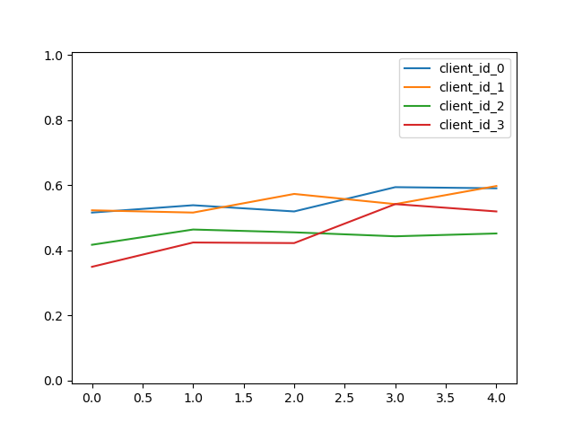

# FedEEG
A Federated Approach towards emotion learning using EEG-brain wasves. Privacy is of great concern for personal data, taking this concept up a notch, the concept of brain wave leakage would be of great privacy concern. Therefore, I have implemented Federated Learning for Hand Movement Detection on  4 client dataset. This allows each of the users to conserve their privacy while training an aggregate model.

## Performance-Track:

## Results:

client_id_0_loss | client_id_0_acc | client_id_1_loss | client_id_1_acc | client_id_2_loss | client_id_2_acc | client_id_3_loss | client_id_3_acc
---|---|---|---|---|---|---|---
0.9628694405158361 | 0.515625 | 0.9564681400855383 | 0.5225694179534912 | 1.0691524545351665 | 0.4166666567325592 | 1.114998849729697 | 0.3489583432674408
0.9289976650228103 | 0.5381944179534912 | 0.9217653137942156 | 0.515625 | 1.0365764796733856 | 0.4635416567325592 | 1.3993440320094426 | 0.4236111044883728
0.9374355437854925 | 0.5190972089767456 | 0.8785319017867247 | 0.5729166865348816 | 1.0338255328436692 | 0.4548611044883728 | 1.1058493840197723 | 0.421875
0.8807635648796955 | 0.59375 | 1.0283631086349487 | 0.5416666865348816 | 1.0530484008292358 | 0.4427083432674408 | 0.9789415535827478 | 0.5416666865348816
0.9172444740931193 | 0.5902777910232544 | 0.8444005412360033 | 0.5972222089767456 | 1.0650703931848209 | 0.4513888955116272 | 0.9781554614504179 | 0.5190972089767456

